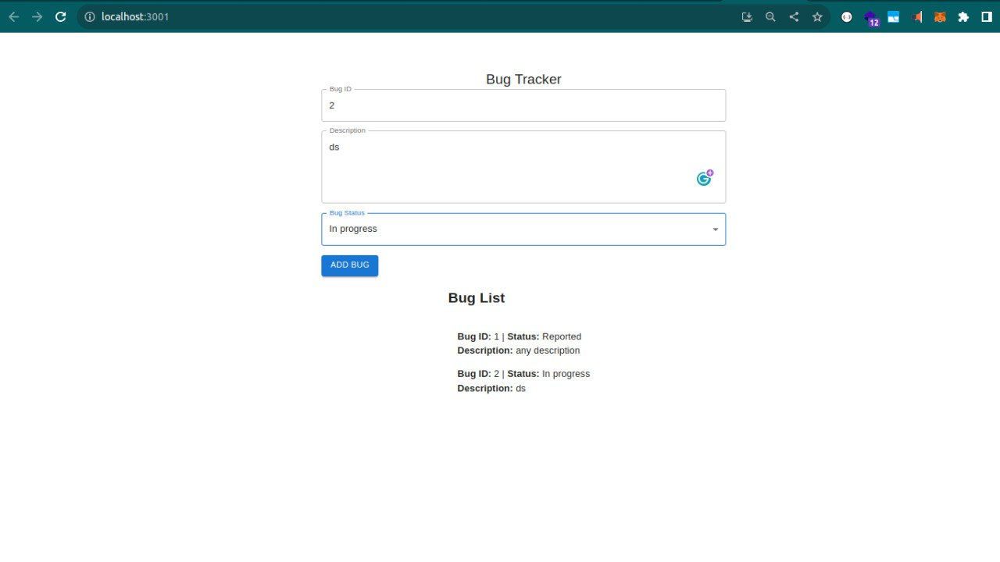
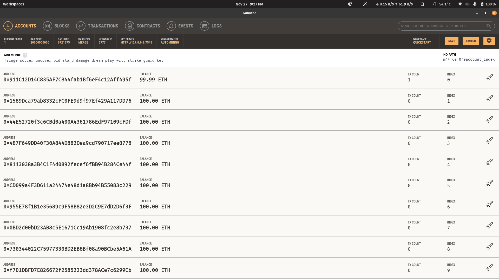
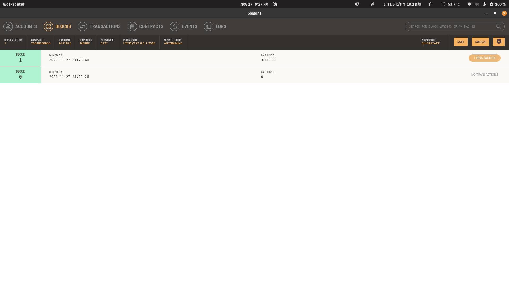
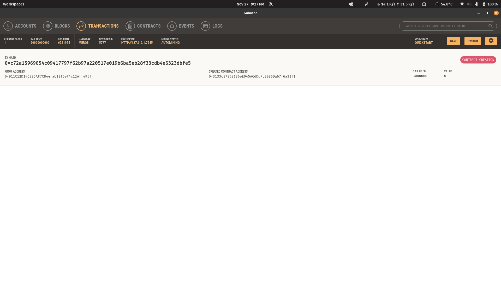
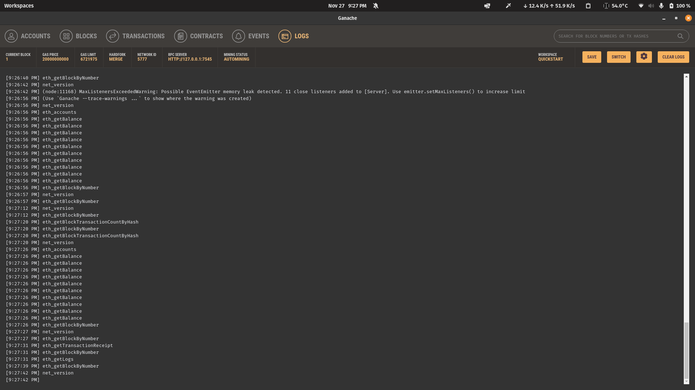

How to run
============

Run frontend
--------------

- Go to the folder ``bug-tracker-frontend``. Run ``npm install && npm run``.

Run backend
-------------

- Go to the folder ``bug-tracker-backend``. Run ``npm install && npm run``.

Run Ganache
------------

The transactions and bugs list can be seen:

